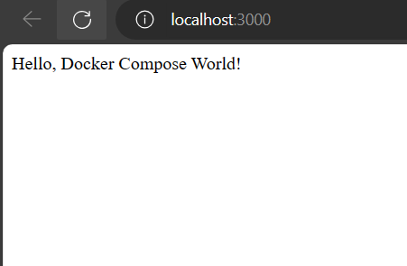

# Explanation

## Directory Structure:
App folder: App folder is NodeJS application directory.
- app.js: Contains application code of nodejs application
- Dockerfile: This Dockerfile uses the official Node.js image as a base, sets the working directory, copies package.json to install dependencies, copies the rest of the application code, exposes port 3000 (the port your Node.js app is listening on), and defines the command to run your application.
- Pacjage.json: package.json file for this Node.js application contains metadata about the application and its dependencies. To install the dependencies listed in the package.json, run 'npm install', and npm will fetch and install them.

## Docker Compose Configuration File
The Docker Compose configuration defines a multi-container application composed of three services: node-app, nginx, and mysql. Each service serves a specific purpose, and they work together to create a development environment for a Node.js application with Nginx as a reverse proxy and a MySQL database.
- node-app: It is a service defined for our nodejs application. 'Build' indicates that the service will be built using a Dockerfile located in the ./app directory. The context specifies the build context, which is the directory where the Dockerfile and application files are located. 'ports' maps port 3000 on our host to port 3000 in the node-app container, allowing us to access the Node.js application at http://localhost:3000.
- nginx service: nginx is a service running the official Nginx image (nginx:latest).'ports' maps port 80 on the host to port 80 on the Nginx container. 'volumes' mounts an Nginx configuration file from the local directory (./nginx/default.conf) into the Nginx container at /etc/nginx/conf.d/default.conf. This configuration file likely contains settings for Nginx to act as a reverse proxy for our Node.js application. 'depends_on' specifies that the nginx service depends on the node-app service. This ensures that Nginx starts only after the Node.js application is up and running.
- mysql-service: mysql is a service running the official MySQL image (mysql:latest). 'environment' sets environment variables for configuring the MySQL service, including the root password, database name, user, and user password. 'ports' maps port 3306 on your host to port 3306 in the MySQL container.

## Nginx Configuration file 
- 'location / {': This block defines how Nginx should process requests that match the location defined here, which is the root directory ("/"). This means it will handle all requests to the server.
- 'proxy_pass http://node-app:3000;': This directive is the heart of the reverse proxy configuration. It instructs Nginx to forward incoming requests to a backend server running at the specified URL, in this case, "http://node-app:3000."
- 'proxy_set_header Host $host;': This directive sets the "Host" header of the forwarded request to the value of the original request's "Host" header. This is important because the backend Node.js application may use the "Host" header for routing and virtual hosting purposes. 
- 'proxy_set_header X-Real-IP $remote_addr;': This directive sets the "X-Real-IP" header of the forwarded request to the IP address of the client making the request. This can be useful for the backend application to access information about the client's real IP address, especially when Nginx is used as a reverse proxy in a load-balanced environment.

In summary, this Nginx server block listens for HTTP requests on port 80 with the "localhost" hostname. It forwards these requests to a Node.js application running on port 3000 using a reverse proxy configuration, while also passing along important headers for proper request handling.

### Running the docker compose
 ```console
docker compose up -d
```
To stop and remove all containers of the sample application run:

```console
docker compose down
```
## Output

