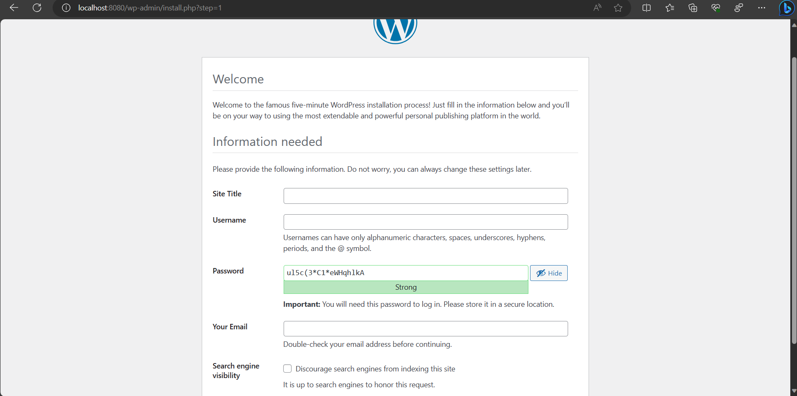

# Explanation

## Docker Compose Configuration File
The Docker Compose file, which is used to define and manage multi-container Docker applications. In this specific docker-compose.yml file, a Dockerized WordPress setup is defined, including WordPress itself, a MySQL database, and an Nginx web server acting as a reverse proxy.
- wordpress-service: image: Specifies the Docker image to use for WordPress, in this case, the latest version. Mounts a local directory "./wp-content" to the WordPress container's "/var/www/html/wp-content" directory for persisting WordPress content. 'depends_on' Specifies that this service depends on the "mysql" service, ensuring that the database is started before WordPress. Sets environment variables for the WordPress container, specifying the database host, user, password, and database name and maps port 8080 on the host to port 80 in the container, allowing you to access WordPress via http://localhost:8080.
> **Note**
> PHP configurations given in the question is not applicable here becaue I am hosting the NodeJS application on localhost.
- php-fpm service: This section defines the PHP-FPM service. Specifies the Docker image to use for PHP-FPM and maps port 9000 on the host to port 9000 in the container, which is commonly used for PHP-FPM. Mounts a local directory "./wp-content" to the PHP-FPM container's "/var/www/html/wp-content" directory for sharing WordPress content.
- nginx service: nginx is a service running the official Nginx image (nginx:latest).'ports' maps port 80 on the host to port 80 on the Nginx container. 'volumes' mounts an Nginx configuration file from the local directory (./nginx/default.conf) into the Nginx container at /etc/nginx/conf.d/default.conf. This configuration file likely contains settings for Nginx to act as a reverse proxy for our Node.js application. 'depends_on' specifies that the nginx service depends on the node-app service. This ensures that Nginx starts only after the Node.js application is up and running.
- mysql-service: mysql is a service running the official MySQL image (mysql:latest). 'environment' sets environment variables for configuring the MySQL service, including the root password, database name, user, and user password.
- wp-net network: Defines a custom Docker network named "wp-net." All services within this docker-compose.yml file are connected to this network, allowing them to communicate with each other.
- Data container:  A data container is used to share data between services. It can be used for persistent storage of wordpress application files and MySQL data.


## Nginx Configuration file 
> **Note**
> Some of the nginx configurations given in the question is not applicable here becaue I am hosting the wordpress application on localhost.

- 'location / {': This block defines how Nginx should process requests that match the location defined here, which is the root directory ("/"). This means it will handle all requests to the server.
- 'proxy_pass http://node-app:3000;': This directive is the heart of the reverse proxy configuration. It instructs Nginx to forward incoming requests to a backend server running at the specified URL, in this case, "http://node-app:3000."
- 'proxy_set_header Host $host;': This directive sets the "Host" header of the forwarded request to the value of the original request's "Host" header. This is important because the backend Node.js application may use the "Host" header for routing and virtual hosting purposes. 
- 'proxy_set_header X-Real-IP $remote_addr;': This directive sets the "X-Real-IP" header of the forwarded request to the IP address of the client making the request. This can be useful for the backend application to access information about the client's real IP address, especially when Nginx is used as a reverse proxy in a load-balanced environment.

In summary, this Nginx server block listens for HTTP requests on port 80 with the "localhost" hostname. It forwards these requests to a Node.js application running on port 3000 using a reverse proxy configuration, while also passing along important headers for proper request handling.

### Running the docker compose
 ```console
docker compose up -d
```
To stop and remove all containers of the sample application run:

```console
docker compose down
```
## Output

