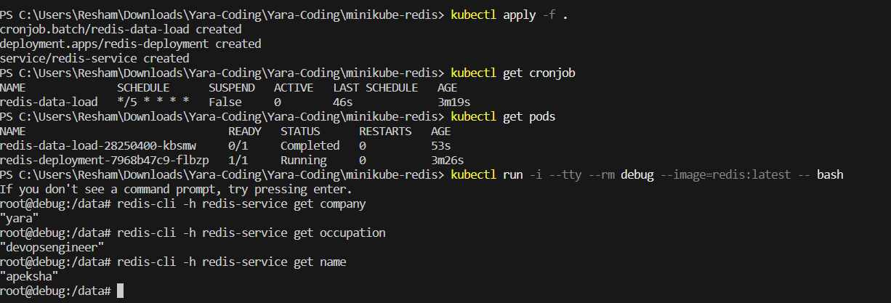

# Explanation
> **Note**
> Alternative solution to coreOS and fleetctl deployment is using kubernetes and kubectl. 

- redis deployment:  It is used to define and manage the deployment of a Redis container within a Kubernetes cluster.
- cronjob: The provided configuration is a Kubernetes CronJob manifest written in YAML format. It defines a CronJob resource for running a job that loads data into - 
 Redis using the redis-cli command-line tool.
- redis-svc: The provided configuration is a Kubernetes Service manifest written in YAML format. It defines a Service resource named "redis-service," which is used to expose a network service that allows other components within a Kubernetes cluster to access a Redis application.

## Running the files
```
$ minikube start
$ kubectl apply -f .
$ kubectl get cronjob
```
Verify Data in Redis:

```
$ kubectl run -i --tty --rm debug --image=redis:latest -- bash
$ redis-cli -h redis-service get key1
```

## Output

